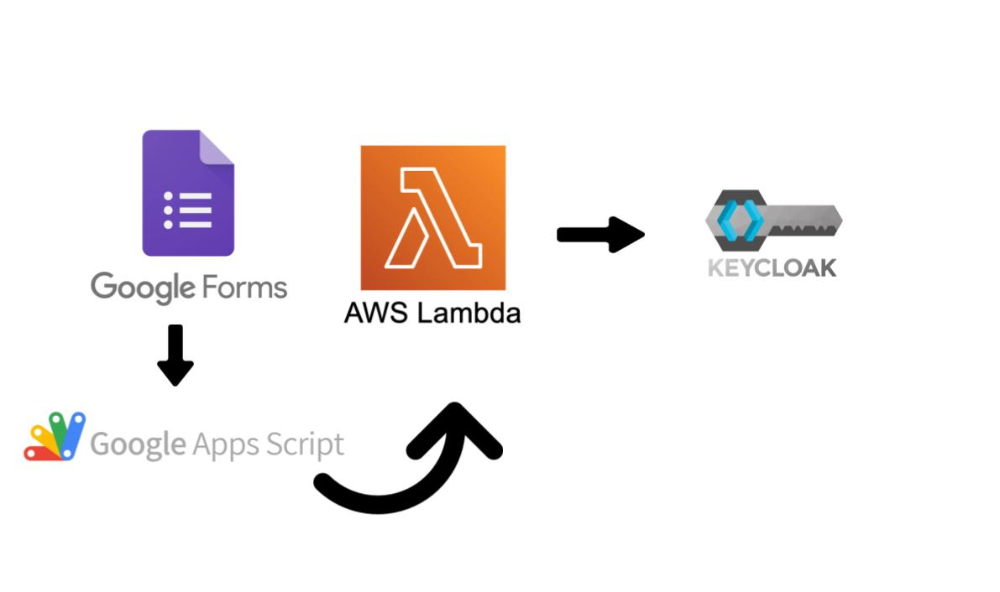

# Nebari user's from Google Form

[](https://github.com/Quansight/nebari-users-create-from-google-form/actions/workflows/deploy_lambda.yml)
[](https://github.com/nebari-dev/nebari-users-create-from-google-form/actions/workflows/deploy_appscript.yml)

This will create users in Nebari using Keycloak's API.

The information flow is like the following:

1. User fills in Google Form
2. Google App's Script listens to form submission and sends the form data to AWS Lambda.
3. AWS Lambda then calls the Keycloak's API to add users to the Nebari Deployment

## Architecture

Below is a brief diagram for the architecture:



## Creating credentials to deploy AppScript

- Setting up clasp

```
npm install @google/clasp -g
```

```bash
clasp login
```

- Set `.clasprc.json` (file in your home directory) to `CLASPRC` GitHub Actions secret

```bash
cat ~/.clasprc.json
```
